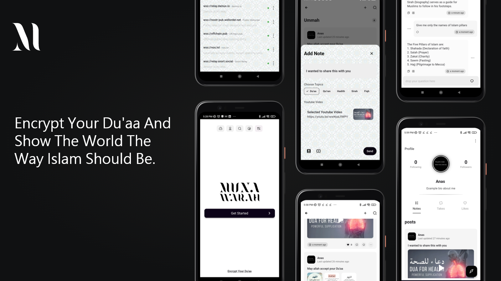

# Munawarah

 

## Screenshots
 

 

> **The app still under heavy development, so some of the features may not work as expected, and some of the features are on our road map and will be implemented sooner.**

 

## What is Munawarah?

Munawarah is an Islamic social app where you can share & discover Islamic content, connect with friends and get instant answers to your questions.

Nostr is an open protocol that enables a truly censorship-resistant and global social network, Munawarah upgrades trust in Islam with cryptographic keys to help purify intentions online, it make use of Nostr in order to provide a decentralized social network where you own everything you share, and no one can manipulate you or your data.

With Munawarah, say goodbye to Centralized Feeds, Distractions, Ads and algorithms that make use of your data to manipulate you, and welcome to a secure, encrypted, decentralized and private social network.

## Why Munawarah?

- it don't require verification-based registration, No need to an email, phone number or any other personal information to sign up, just a few steps and you're ready to go.
- it allows you to manage almost everything you need, you can manage yuor account/profile, source to read/write data, the app UI, and more..
- it's decentralized, so no one can censor you or your content.
- it's encrypted, our End-to-End encryption makes sure that no one can spy on you or your Dms.

### Features

- Set of quick useful actions when using Munawarah for the first time for:
  - Visualizing the default connected relays informations used.
  - Quick navigation to steps flows of authenticating.
  - Quick search for a specific user using his public key or his internet Identifier (NIP 05 identifier).
  - Theme Switcher for switching between light and dark mode.
  - Language Switcher for switching between more than 8+ supported languages.

- Easy and simple flow for creating a new account or authenticating with your existing one.

- Auto remember of your account, so you don't have to authenticate every time you open the app unless you want to.

- Easy retrieval of your account keys, in case you lost your device or you want to authenticate from another device.

- A Social Network where you can:
  - Discover Feeds of Dedicated Islamic Content By the whole Ummah, by topics, and by people You Follow.
  - Advanced Search for searching over a specific feed, allowing you to filter by username, keywords, date range.. and sort it alphabetically.
  - Share Your Thoughts, Questions, Images, Notes,Youtube Videos, and more..
  - Follow other people, react & comment on their posts, or even take (repost) them to your own profile.
  - Manage your own profile, by selecting your own profile picture from your gallery or by taking a new one, changing your name, username, bio and more..
  - Track your followers and following, as well as tracking your own posts, takes (reposts), likes.
  - Add, Remove or modify the relays you want to use to connect to our network, and reconnect to them whenever syou want.
  - Nostr NIP05 verification where you can verify your account with your NIP05 identifier, and get a verified badge on your profile.
  - Much more..

- Our AI Imam On Duty that allows you to:
  - Discover a list of the most commonly asked questions related to Islam.
  - Get your Imam on Duty to know about your level of knowledge before answering your question.
  - Get instant answers to questions related to Islam.
  - Much more..

Start using Munawarah now, and be part of the future of social networks.

## Download

You can downlaod and try using Munawarah from [the releases page](https://github.com/Munawarah-App/Munawarah/releases/), we recommend you to check it time to time as new releases will be shipped.
